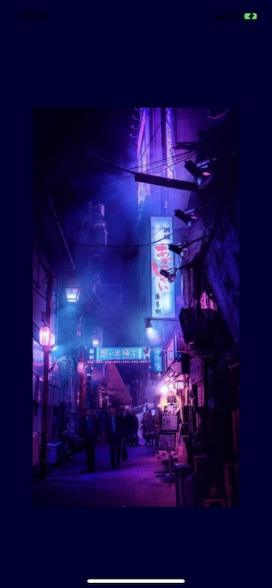
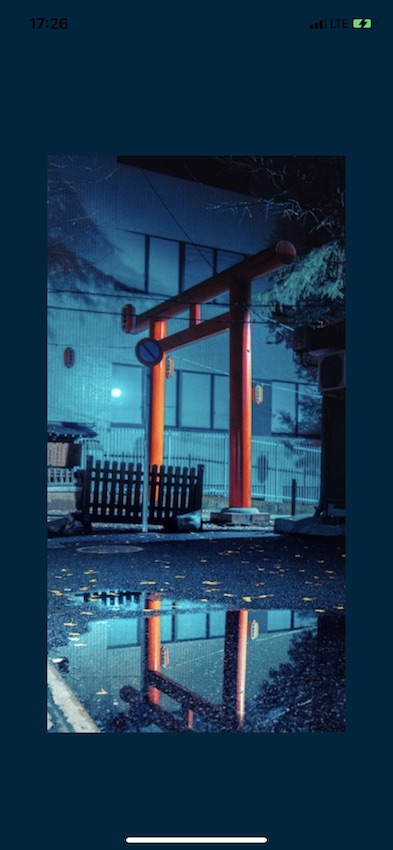
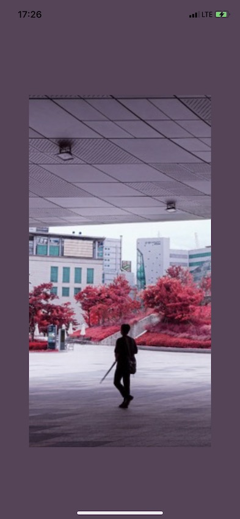
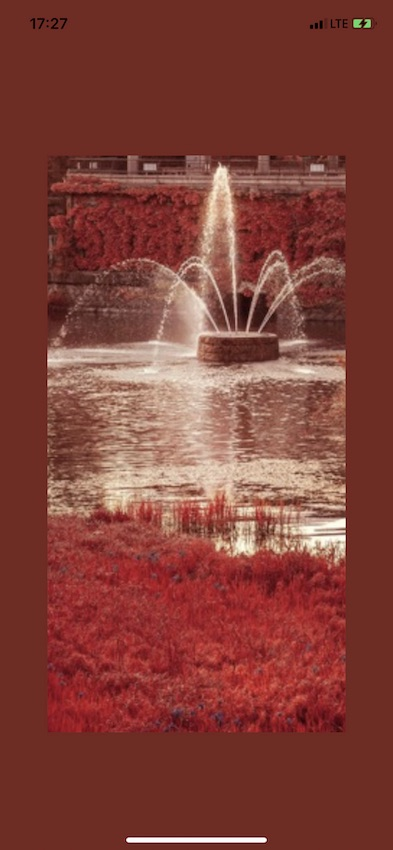

# Background Color Image Effect

> COPYRIGHT NOTICE: ALL PHOTOS INSIDE THIS REPOSITORY BELONG TO [LIAM WONG](https://twitter.com/liamwong)!

Change the background color of an UIView according to the image inside the UIImageView.

| Example 1 | Example 2 | Example 3 | Example 4 |
| :-------: | :-------: | :-------: | :-------: |
|  |  |  |  |
| Photo © [Liam Wong](https://twitter.com/liamwong) | Photo © [Liam Wong](https://twitter.com/liamwong) | Photo © [Liam Wong](https://twitter.com/liamwong) | Photo © [Liam Wong](https://twitter.com/liamwong) |

# Inspiration
When you swipe through photos inside the Twitter app on iOS the background color of the view changes according to the image. This effect is also visible on their website. Check out this tweet, swipe through the pictures and pay attention to the background color of the view: [Photo Tweet Example](https://twitter.com/Procreate/status/1166677128173109249).

# How I did it
I wanted to reproduce this effect. I've used the [average color](https://www.hackingwithswift.com/example-code/media/how-to-read-the-average-color-of-a-uiimage-using-ciareaaverage) of the image and [darkend it](https://stackoverflow.com/questions/38435308/get-lighter-and-darker-color-variations-for-a-given-uicolor
) by 15%.

You find the code for the average color and the darkening inside the ```UIColor+UIImage+Extension.swift``` file.
